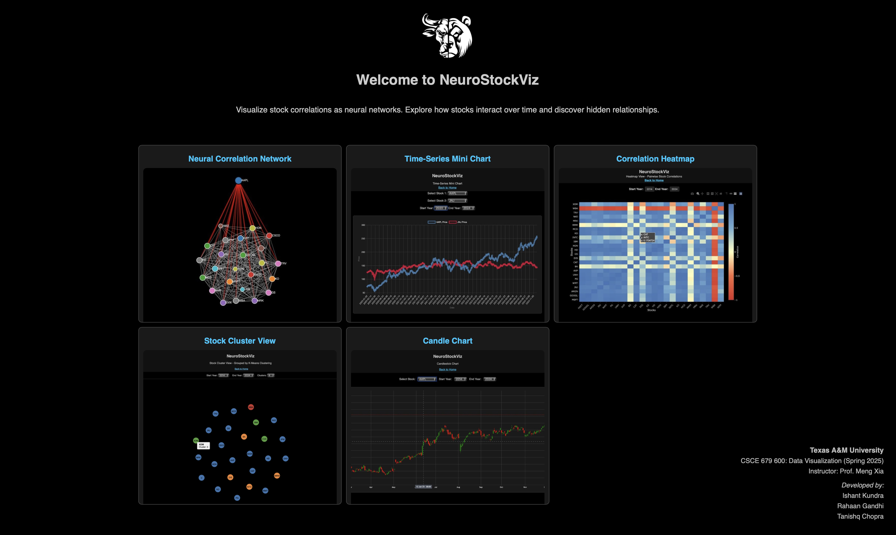
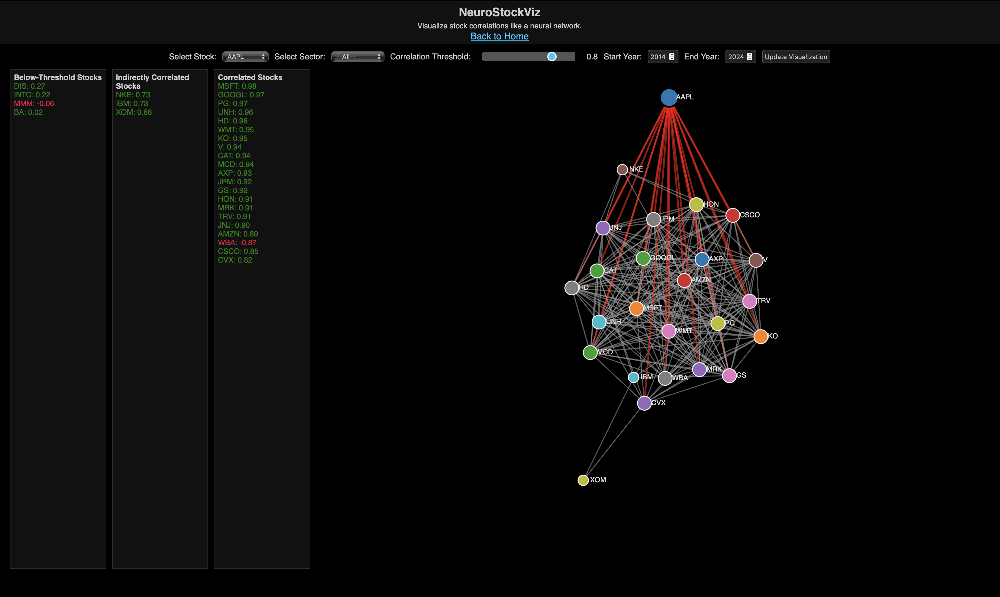
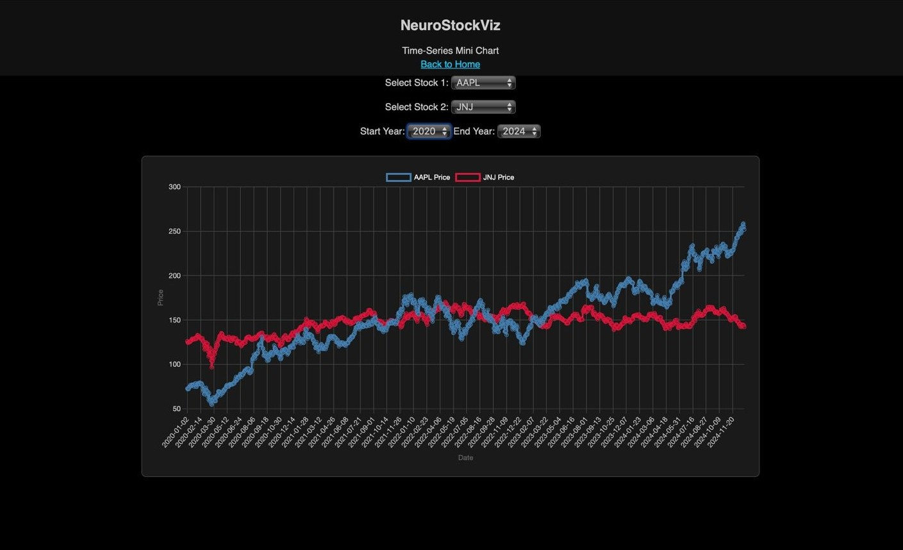
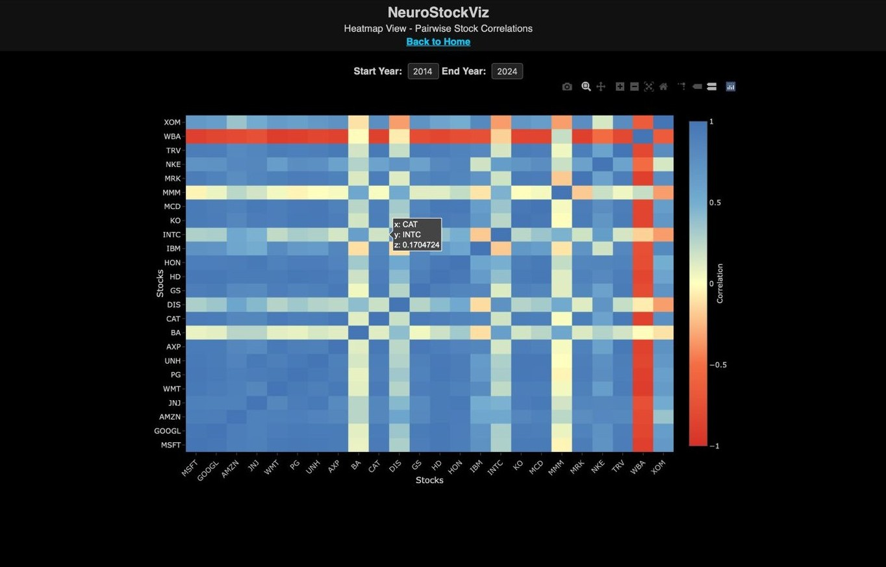
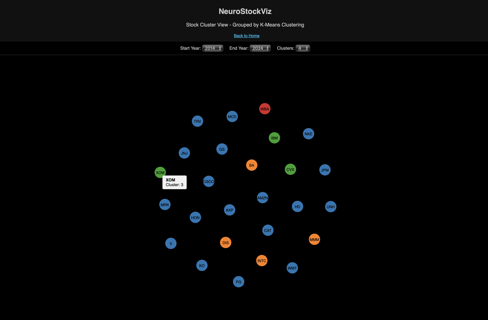
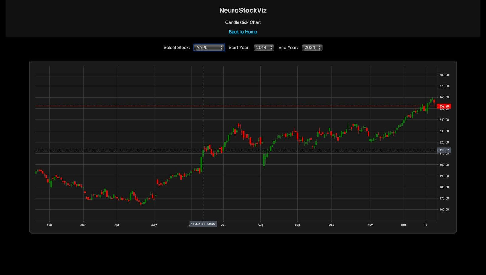

# 🧠 NeuroStockViz

Visualizing Stock Correlations as Neural Networks  
**CSCE 679: Data Visualization — Spring 2025**  
**Instructor:** Prof. Meng Xia  
**Developed by:**
- Tanishq Chopra  
- Ishant Kundra  
- Rahaan Gandhi  

---

## 📌 Project Overview

**NeuroStockViz** is an interactive multi-view web application that visualizes relationships between Dow Jones 30 stocks using neural network graphs, heatmaps, clustering, and candlestick charts.

Built as a final project for **Texas A&M University's CSCE 679: Data Visualization (Spring 2025)**.

---

## ✨ Features

| View Name              | Description                                                                 |
|------------------------|-----------------------------------------------------------------------------|
| Neural Correlation     | Explore stock correlations via an interactive graph layout                  |
| Time-Series Mini Chart | Compare price trends of two stocks over time using a line chart             |
| Correlation Heatmap    | Visualize pairwise Pearson correlation between all 30 Dow Jones stocks      |
| Stock Cluster View     | Cluster stocks using K-Means on correlation patterns                        |
| Candlestick Chart      | Analyze detailed OHLC patterns over selected date ranges                    |

---

## 🧰 Tech Stack

- **Frontend:** HTML5, CSS3, JavaScript, D3.js, Lightweight-Charts  
- **Backend:** Python, Flask, yFinance, Pandas, Scikit-learn, Flask-Caching  
- **Data Source:** Yahoo Finance via `yfinance`

---

## 📁 Project Structure

<pre>
NeuroStockViz/
├── static/
│   └── images/              # Visual preview images
│       ├── candlestick.jpg
│       ├── cluster.png
│       ├── head.jpg
│       ├── heatmap.jpg
│       ├── line.jpg
│       ├── main.jpg
│       ├── NCN2.jpg
│       └── ncn.jpg
├── templates/               # HTML files for each visualization
│   ├── candlestick.html
│   ├── clusters.html
│   ├── heatmap.html
│   ├── home.html
│   ├── index.html           # Neural correlation view
│   └── minichart.html
├── Document/              
│   ├── NeuroStockViz-Visualizing-Stock-Correlations.pptx
│   ├── report.pdf
│   └── Demo Video.mov
├── app.py                   # Flask routes and backend logic
├── LICENSE
├── .gitattributes
├── README.md                # Project documentation
└── .gitignore
</pre>

---

## 🚀 Getting Started

1. **Clone the Repository**

```bash
git clone https://github.com/ishantkundra/NeuroStockViz.git
cd NeuroStockViz
```

2. **Install Dependencies**

```bash
pip install flask yfinance pandas scikit-learn flask-caching
```

Optional: Generate `requirements.txt`  
```bash
pip freeze > requirements.txt
```

3. **Run the Application**

```bash
python app.py
```

4. **Open in Browser**

Go to: [http://localhost:5000](http://localhost:5000)

---

## 🖼️ Preview Screenshots

#### 🏠 Home Page


#### 🧠 Neural Correlation Network


#### 📈 Time-Series Mini Chart


#### 🔥 Correlation Heatmap


#### 🧩 Stock Clustering View


#### 📊 Candlestick Chart


---

## 🔍 Use Cases

- Compare sector-based stock performance  
- Identify correlated and anti-correlated stocks  
- Track price trends via technical analysis  
- Explore stock groupings using clustering  

---

## 🌱 Future Enhancements

- Export visualizations (PNG/PDF)  
- Add historical comparison tables  
- Expand to S&P 500 / NASDAQ-100 stocks  

---

## 📜 License

MIT License — for educational and academic use only.

---

## 👨‍💻 Authors

**Tanishq Chopra**  
*M.S. Computer Science, Texas A&M University*

📧 [tanishqtc1980@gmail.com](mailto:tanishqtc1980@gmail.com)

**Ishant Kundra**  
*M.S. Computer Science, Texas A&M University*  

📧 [ishantkundra9@gmail.com](mailto:ishantkundra9@gmail.com)

**Rahaan Gandhi**  
*M.S. Computer Science, Texas A&M University*

📧 [rahaan123@gmail.com](mailto:rahaan123@gmail.com)

